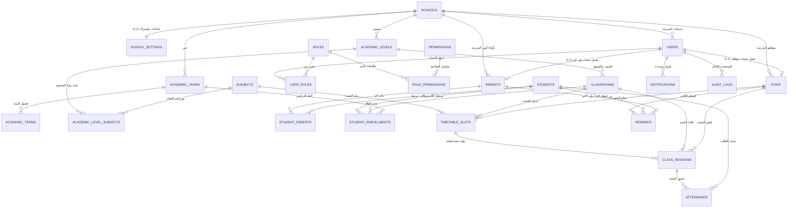

# دليل وتوثيق هيكل قاعدة البيانات (Database Architecture & Schema Guide)
نظام الإدارة المدرسية المتكامل (Enterprise School Management System)
**محرك قاعدة البيانات: MySQL 8.0+ (InnoDB - utf8mb4)**

---

## 📌 1. نظرة عامة (Overview)
تم إعداد هذا الهيكل البرمجي ليكون متوافقاً مع قواعد بيانات **MySQL 8.0+** ومبنياً ليعمل بكفاءة عالية على مقاييس تشغيلية ضخمة (**High Scalability & Multi-Tenancy SaaS**). 

### 🌟 أبرز التحسينات المعمارية في هذا الإصدار:
1. **فصل حساب الدخول (Auth) عن الملف الشخصي (Profile):**
   * جدول `users` مخصص للمصادقة وتفعيل الحساب فقط.
   * جدول `staff` يمثل الموظف والمعلم في المدرسة (`user_id = NULL` حتى يُفعّل الحساب).
   * جدول `parents` يمثل ولي الأمر بملفه وبياناته (`user_id = NULL` حتى يُفعّل التطبيق).
2. **توليد اسم مستخدم ذكي (`username`):**
   * عند تفعيل الحساب يتم توليد اسم مستخدم تلقائي مميز غير مكرر (مثل `ROW-FAM-1029` لولي الأمر، و `ROW-STF-0104` للموظف) لتمكينه من تسجيل الدخول به مع كلمة المرور.

الملف التنفيذي المباشر موجود في المشروع باسم: [`schema.sql`](./schema.sql).

---

## 🏗️ 2. مخطط العلاقات الكيانـية (Entity Relationship Diagram - ERD)

---

## 🗂️ 3. تفاصيل الجداول والوحدات (Modules & Tables)

### أ. المستأجرون والإعدادات (Multi-Tenancy & Settings)
* **`schools`**: الكيان المؤسسي للمدرسة (الاسم، الكود، الرابط المخصص `subdomain`، الشعار، الحالة).
* **`school_settings`**: جدول مخصص ومفصل مرتبط بالمدرسة (One-to-One):
  * **فترة التأجير والاشتراك السحابي:** خطة الاشتراك (`subscription_plan`)، وتاريخ بداية الاشتراك (`subscription_start_date`)، وتاريخ نهاية التأجير والاشتراك (`subscription_end_date`).
  * **المظهر والسمات (Theme):** الألوان الأساسية والثانوية (`primary_color`, `secondary_color`)، نمط العرض (`theme_mode`: light/dark/system)، وأيقونة المتصفح (`favicon_url`).
  * **الدوام والتوقيت:** المنطقة الزمنية (`timezone`)، وقت بداية اليوم المدرسي (`school_start_time`)، وقت الانصراف (`school_end_time`)، وأيام العطلة الأسبوعية (`weekend_days`).
  * **`extra_config` (JSON):** لأي تخصيصات إضافية مرنة مستقبلاً.

### ب. المصادقة والأدوار (Pure Auth & RBAC)
* **`users`**: جدول المصادقة وتفعيل الحسابات:
  * `username`: اسم مستخدم فريد ومولد تلقائياً (مثل `ROW-FAM-4910`).
  * `phone_number` & `email`: بيانات التحقق والدخول.
  * `password_hash`: كلمة المرور المشفرة.
  * `user_type`: نوع الحساب (`staff`, `parent`, `super_admin`).
  * `status`: حالة الحساب (`active`, `pending_activation`, `suspended`).
* **`roles` & `permissions` & `user_roles`**: لتحديد صلاحيات الدخول بدقة.

### ج. الكيانات الواقعية للموظفين وأولياء الأمور (Domain Profiles)
* **`staff`**: ملفات الموظفين والمعلمين:
  * يحتوي على: الرقم الوظيفي `employee_number`، الاسم الكامل، المسمى `job_title`، التخصص `specialization`، تاريخ التعيين `hire_date`.
  * حقل `user_id`: يكون **`NULL`** حتى يُفعّل الموظف حسابه على المنظومة!
* **`parents`**: ملفات أولياء الأمور:
  * يحتوي على: الاسم الكامل، رقم الهاتف، الهوية، الوظيفة `occupation`، والعنوان.
  * حقل `user_id`: يكون **`NULL`** حتى يفتح ولي الأمر التطبيق ويُفعّل حسابه.

### د. الهيكل الأكاديمي (Academic Structure)
* **`academic_years`**: الأعوام الدراسية (مثل 2026-2027) مع تحديد العام الفعّال `is_current`.
* **`academic_terms`**: الفصول الدراسية (الترم الأول، الثاني، الثالث).
* **`academic_levels`**: المستويات والصفوف الدراسية (الأول الابتدائي، الصف العاشر...).
* **`classrooms`**: الشُعب الدراسية (شعبة أ، 1/2، ...) مع السعة وموقع الغرفة وترتبط بالمستوى الدراسي (`academic_level_id`).
* **`subjects`**: المواد الدراسية العامة وعدد ساعاتها المعتمدة وكود المادة.
* **`academic_level_subjects`**: الخطة الدراسية وتوزيع المواد وكتب المناهج وعدد الحصص ودرجات النجاح والعظمى لكل صف.

### هـ. الطلاب وأولياء الأمور والتسجيل (Students & Enrollments)
* **`students`**: بيانات الطالب الأساسية (الاسم، الهوية، تاريخ الميلاد، حقل `metadata (JSON)` للبيانات الصحية والحساسية وفصيلة الدم).
* **`student_parents`**: جدول وسيط يربط الطالب بملف ولي أمره في جدول **`parents`** (Many-to-Many):
  * صلة القرابة `relationship_type` (أب، أم، كفيل، أخ، سائق).
  * جهة الاتصال الأساسية `is_primary_contact`.
  * الصلاحية لاستلام الطالب عند الانصراف `can_pickup`.
* **`student_enrollments`**: الأرشيف السنوي لانتقال الطالب من شعبة لأخرى وسنة لأخرى دون فقدان السجل التاريخي.

### و. الجداول والحصص (Timetable & Sessions)
* **`timetable_slots`**: قالب الجدول الأسبوعي للشعبة بربط المادة بالمعلم من جدول **`staff`**.
* **`class_sessions`**: الحصة الفعلية بتاريخ محدد لتسجيل عنوان الدرس (`topic_title`) وربط الحضور بها مع المعلم من **`staff`**. (سُميت class_sessions لمنع أي تعارض مع جدول جلسات الدخول sessions التابع للارافيل).

### ز. الحضور والانصراف (Attendance Engine)
* **`attendance`**: يدعم الحضور اليومي للمدرسة (`daily`) وحضور الحصص (`session`) مع تسجيل الدخول والخروج ودقائق التأخير ومسؤول الرصد.

### ح. الملاحظات والتواصل (Remarks & Notes)
* **`remarks`**: يربط المعلم الكاتب من جدول **`staff`** بالطالب المعني، مع توثيق إقرار ولي الأمر بالقراءة من جدول **`parents`** ومستوى السرية (`visibility: staff_only / parents_and_staff`).

### ط. الإشعارات وسجل العمليات (Notifications & Audit Logs)
* **`notifications`**: صندوق إشعارات حسابات المستخدمين (`users`).
* **`audit_logs`**: الصندوق الأسود لتتبع حركات النظام والتعديلات الحساسة.

---

## ⚡ 4. التوافقية والحلول الهندسية في MySQL 8.0+

1. **دعم الـ UUIDs تلقائياً:**
   * تم استخدام `CHAR(36) NOT NULL DEFAULT (UUID())` في كافة المعرفات الأساسية.
2. **حل مشكلة الـ Soft Deletes مع الـ Unique Keys:**
   * تم استخدام العمود الافتراضي `active_flag` المرتبط بـ `deleted_at` لمنع تكرار الهويات النشطة والسماح بها بعد الحذف.
3. **التحديث التلقائي للوقت (`updated_at`):**
   * الاعتماد على ميزة MySQL المدمجة:
     `DATETIME(6) NOT NULL DEFAULT CURRENT_TIMESTAMP(6) ON UPDATE CURRENT_TIMESTAMP(6)`.
4. **توليد أسماء المستخدمين (`username`):**
   * الحقل مصمم ومفهرس كـ `UNIQUE` ليقبل الأسماء المنسقة مثل:
     `{SchoolCode}-{RoleCode}-{UniqueDigits}`.
